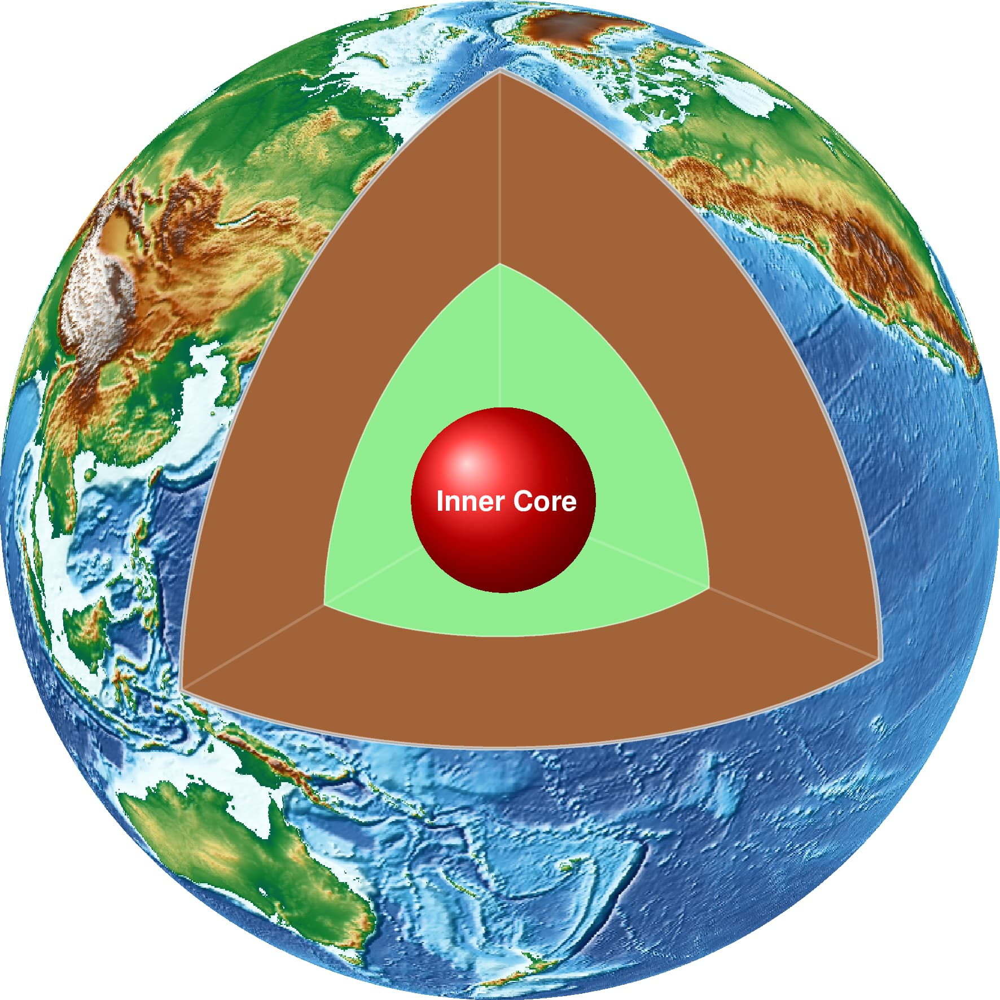
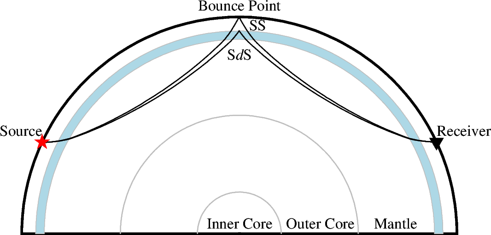

# Dongdong Tian's Science Graphics Collection

## Gallery

Click the figure caption to check out the scripts and data that are used to generate the
figure.

| [3D Earth](./3DEarth/)| [SS raypath](./SS_raypath)|
|---|---|
|  |  |

## Dependencies

Most of the figures are created by GMT, PyGMT and Matplotlib. See the `environment.yml`
file for the full list of dependencies.

## License

The repository is licensed under [Unlicense](LICENSE).
